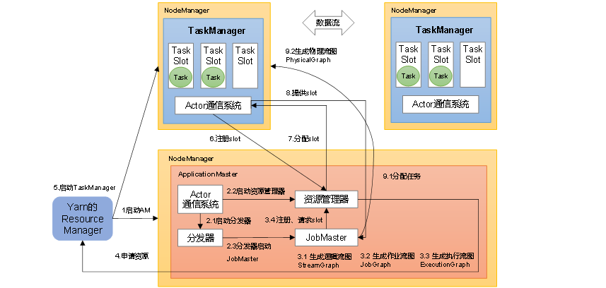

**实时项目**

```
截至时间2024-04-18，flink最稳定的版本，1.19.0
```

##### flink概述

###### 应用场景

```
电商和市场营销
			实时数据报表，广告投放，实时推荐
物联网
	传感器实时数据采集和显示，实时报警，交通运输业
物流配送和服务业
			 订单状态实时更新，通知消息推送
银行和金融业
		  实时结算和通知推送，实时检测异常行为
```

###### 分层api

```
sql
table  api
datastream/datasetapi
有状态流处理
```

##### 快速上手

###### 项目创建

```
批处理
流处理
socket数据接收
```

##### flink部署

###### 集群角色

```
FlinkClient
			提交Job给JobManager(协调调度中心)
										 JobManager下发给TaskManager
										 						  TaskManager才是干活的人，负责数据的处理						 
```

###### 打包插件

```
 <build>
        <plugins>
            <!-- 组装 assembly-->
            <plugin>
                <groupId>org.apache.maven.plugins</groupId>
                <artifactId>maven-assembly-plugin</artifactId>
                <version>3.0.0</version>
                <configuration>
                    <descriptorRefs>
                        <descriptorRef>jar-with-dependencies</descriptorRef>
                    </descriptorRefs>
                </configuration>
                <executions>
                    <execution>
                        <id>make-assembly</id>
                        <phase>package</phase>
                        <goals>
                            <goal>single</goal>
                        </goals>
                    </execution>
                </executions>
            </plugin>
        </plugins>
    </build>
```

###### 任务提交

```
页面提交，独立运行 ， 启动集群，用不带依赖的jar，上传jar,编辑参数任务运行

命令行提交任务，启动集群，提交任务
./bin/flink run -m hadoop31:8081 -c com.zfq.fo.flink.DataGetSocket  ./realtime-flink-1.0-SNAPSHOT.jar -host hadoop31 -port 8989
这里的参数 -m指定了提交到的JobManager，-c指定了入口类。 后面2个参数是程序运行时必需参数
```

###### 部署模式

```
在一些应用场景中，对于集群资源分配和占用的方式，可能会有特定的需求。Flink为各种场景提供了不同的部署模式，主要有以下三种：
会话模式（Session Mode）、单作业模式（Per-Job Mode）、应用模式（Application Mode）。
它们的区别主要在于：集群的生命周期以及资源的分配方式；以及应用的main方法到底在哪里执行——客户端（Client）还是JobManager。

会话模式其实最符合常规思维。我们需要先启动一个集群，保持一个会话，在这个会话中通过客户端提交作业。集群启动时所有资源就都已经确定，所以所有提交的作业会竞争集群中的资源，规模小执行时间短的作业

会话模式因为资源共享会导致很多问题，所以为了更好地隔离资源，我们可以考虑为每个提交的作业启动一个集群，这就是所谓的单作业(Per-Job)模式。
作业完成后，集群就会关闭，所有资源也会释放。这些特性使得单作业模式在生产环境运行更加稳定，所以是实际应用的首选模式。需要注意的是，Flink本身无法直接这样运行，所以单作业模式一般需要借助一些资源管理框架来启动集群，比如YARN、Kubernetes(K8s)

前面提到的两种模式下，应用代码都是在客户端上执行，然后由客户端提交给JobManager的。但是这种方式客户端需要占用大量网络带宽，去下载依赖和把二进制数据发送给JobMamager;加上很多情况下我们提交作业用的是同一个客户端，就会加重客户端所在节点的资源消耗。
所以解决办法就是，我们不要客户端了，直接把应用提交到JobManger上运行。而这也就代表着，我们需要为每一个提交的应用单独启动一个JobManager，也就是创建一个集群。这个JobManager只为执行这一个应用而存在，执行结束之后JobManager也就关闭了，这就是所谓的应用模式。
```

###### **Standalone运行模式**（了解）

```
独立模式是独立运行的，不依赖任何外部的资源管理平台；当然独立也是有代价的：如果资源不足，或者出现故障，没有自动扩展或重分配资源的保证，必须手动处理。所以独立模式一般只用在开发测试或作业非常少的场景下。
```

######  **会话模式部署**

```
Standalone集群的会话模式部署。
提前启动集群，并通过Web页面客户端提交任务（可以多个任务，但是集群资源固定）。
```

######  **单作业模式部署**

```
Flink的Standalone集群并不支持单作业模式部署。因为单作业模式需要借助一些资源管理平台
```

###### **应用模式部署**

```
应用模式下不会提前创建集群，所以不能调用start-cluster.sh脚本。我们可以使用同样在bin目录下的standalone-job.sh来创建一个JobManager。
用例
（1）进入到Flink的安装路径下，将应用程序的jar包放到lib/目录下。
mv  realtime-flink-1.0-SNAPSHOT.jar lib/ 
（2）执行以下命令，启动JobManager
bin/standalone-job.sh start --job-classname com.zfq.fo.flink.DataGetSocket
这里我们直接指定作业入口类，脚本会到lib目录扫描所有的jar包。
（3）同样是使用bin目录下的脚本，启动TaskManager。
bin/taskmanager.sh start


bin/taskmanager.sh stop
bin/standalone-job.sh stop

```

######  **YARN运行模式（重点）**

```
YARN上部署的过程是：客户端把Flink应用提交给Yarn的ResourceManager，Yarn的ResourceManager会向Yarn的NodeManager申请容器。在这些容器上，Flink会部署JobManager和TaskManager的实例，从而启动集群。Flink会根据运行在JobManger上的作业所需要的Slot数量动态分配TaskManager资源。

1）启动集群
（1）启动Hadoop集群（HDFS、YARN）。
（2）执行脚本命令向YARN集群申请资源，开启一个YARN会话，启动Flink集群。
 
[root@hadoop31 flink-1.17.2-yarn]# ./bin/yarn-session.sh -nm test

 可用参数解读：
-d：分离模式，如果你不想让Flink YARN客户端一直前台运行，可以使用这个参数，即使关掉当前对话窗口，YARN session也可以后台运行。
-jm（--jobManagerMemory）：配置JobManager所需内存，默认单位MB。
-nm（--name）：配置在YARN UI界面上显示的任务名。
-qu（--queue）：指定YARN队列名。
-tm（--taskManager）：配置每个TaskManager所使用内存。
注意：Flink1.11.0版本不再使用-n参数和-s参数分别指定TaskManager数量和slot数量，YARN会按照需求动态分配TaskManager和slot。所以从这个意义上讲，YARN的会话模式也不会把集群资源固定，同样是动态分配的。
YARN Session启动之后会给出一个Web UI地址以及一个YARN application ID
 
 任务提交 flink webUi提交
 
 命令行提交
 ./bin/flink run -c com.zfq.fo.flink.DataGetSocket ./realtime-flink-1.0-SNAPSHOT.jar -host hadoop31 -port 8989
 
 Yarn-Session实际上是一个Yarn的Application，并且有唯一的Application ID。
 
 单作业模式部署
在YARN环境中，由于有了外部平台做资源调度，所以我们也可以直接向YARN提交一个单独的作业，从而启动一个Flink集群。

（1）执行命令提交作业。
./bin/flink run -c com.zfq.fo.flink.DataGetSocket ./realtime-flink-1.0-SNAPSHOT.jar -host hadoop31 -port 8989
（2）可以使用命令行查看或取消作业，命令如下。
查看
 ./bin/flink list -t yarn-per-job -Dyarn.application.id=application_1714147315824_0004
 取消  bin/flink cancel -t yarn-per-job -Dyarn.application.id=application_XXXX_YY <jobId>
 ./bin/flink cancel -t yarn-per-job -Dyarn.application.id=application_1714147315824_0004 cb11930515f58f665ceb84366a74c90d
这里的application_XXXX_YY是当前应用的ID，<jobId>是作业的ID。注意如果取消作业，整个Flink集群也会停掉。

应用模式部署
应用模式同样非常简单，与单作业模式类似，直接执行flink run-application命令即可。

1）命令行提交
（1）执行命令提交作业。
 ./bin/flink run-application -t yarn-application -c com.zfq.fo.flink.DataGetSocket realtime-flink-1.0-SNAPSHOT.jar -host hadoop31 -port 8989

（2）在命令行中查看或取消作业。
./bin/flink list -t yarn-application -Dyarn.application.id=application_1714147315824_0005 ->jobid 6bb2399342284c807d26eaa8729f1f06
-- 取消任务
./bin/flink cancel -t yarn-application -Dyarn.application.id=application_1714147315824_0005 6bb2399342284c807d26eaa8729f1f06

上传HDFS提交
hadoop fs -mkdir /flink-dist

-- 任务执行
./bin/flink run-application -yqu hive -t  yarn-application -Dyarn.provided.lib.dirs="hdfs://mycluster/flink-dist" -c com.zfq.fo.flink.DataGetSocket  hdfs://mycluster/flink-dist/realtime-flink-1.0-SNAPSHOT.jar -host hadoop31 -port 8989

```

##### tar 解压到指定目录 -C 

```
tar -zxvf xxx.tar.gz -C /data/program/
```

##### Flink运行时架构

###### 系统架构

```
1）作业管理器（JobManager）
JobManager是一个Flink集群中任务管理和调度的核心，是控制应用执行的主进程。也就是说，每个应用都应该被唯一的JobManager所控制执行。
JobManger又包含3个不同的组件。
（1）JobMaster
JobMaster是JobManager中最核心的组件，负责处理单独的作业（Job）。所以JobMaster和具体的Job是一一对应的，多个Job可以同时运行在一个Flink集群中, 每个Job都有一个自己的JobMaster。需要注意在早期版本的Flink中，没有JobMaster的概念；而JobManager的概念范围较小，实际指的就是现在所说的JobMaster。
在作业提交时，JobMaster会先接收到要执行的应用。JobMaster会把JobGraph转换成一个物理层面的数据流图，这个图被叫作“执行图”（ExecutionGraph），它包含了所有可以并发执行的任务。JobMaster会向资源管理器（ResourceManager）发出请求，申请执行任务必要的资源。一旦它获取到了足够的资源，就会将执行图分发到真正运行它们的TaskManager上。
而在运行过程中，JobMaster会负责所有需要中央协调的操作，比如说检查点（checkpoints）的协调。
（2）资源管理器（ResourceManager）
ResourceManager主要负责资源的分配和管理，在Flink 集群中只有一个。所谓“资源”，主要是指TaskManager的任务槽（task slots）。任务槽就是Flink集群中的资源调配单元，包含了机器用来执行计算的一组CPU和内存资源。每一个任务（Task）都需要分配到一个slot上执行。
这里注意要把Flink内置的ResourceManager和其他资源管理平台（比如YARN）的ResourceManager区分开。
（3）分发器（Dispatcher）
Dispatcher主要负责提供一个REST接口，用来提交应用，并且负责为每一个新提交的作业启动一个新的JobMaster 组件。Dispatcher也会启动一个Web UI，用来方便地展示和监控作业执行的信息。Dispatcher在架构中并不是必需的，在不同的部署模式下可能会被忽略掉。
2）任务管理器（TaskManager）
TaskManager是Flink中的工作进程，数据流的具体计算就是它来做的。Flink集群中必须至少有一个TaskManager；每一个TaskManager都包含了一定数量的任务槽（task slots）。Slot是资源调度的最小单位，slot的数量限制了TaskManager能够并行处理的任务数量。
启动之后，TaskManager会向资源管理器注册它的slots；收到资源管理器的指令后，TaskManager就会将一个或者多个槽位提供给JobMaster调用，JobMaster就可以分配任务来执行了。
在执行过程中，TaskManager可以缓冲数据，还可以跟其他运行同一应用的TaskManager交换数据。
```

###### 核心概念

```
并行子任务和并行度
当要处理的数据量非常大时，我们可以把一个算子操作，“复制”多份到多个节点，数据来了之后就可以到其中任意一个执行。这样一来，一个算子任务就被拆分成了多个并行的“子任务”（subtasks），再将它们分发到不同节点，就真正实现了并行计算。
在Flink执行过程中，每一个算子（operator）可以包含一个或多个子任务（operator subtask），这些子任务在不同的线程、不同的物理机或不同的容器中完全独立地执行。
一个特定算子的子任务（subtask）的个数被称之为其并行度（parallelism）。这样，包含并行子任务的数据流，就是并行数据流，它需要多个分区（stream partition）来分配并行任务。一般情况下，一个流程序的并行度，可以认为就是其所有算子中最大的并行度。一个程序中，不同的算子可能具有不同的并行度。

一个数据流在算子之间传输数据的形式可以是一对一（one-to-one）的直通（forwarding）模式，也可以是打乱的重分区（redistributing）模式，具体是哪一种形式，取决于算子的种类。
（1）一对一（One-to-one，forwarding）
这种模式下，数据流维护着分区以及元素的顺序。比如图中的source和map算子，source算子读取数据之后，可以直接发送给map算子做处理，它们之间不需要重新分区，也不需要调整数据的顺序。这就意味着map 算子的子任务，看到的元素个数和顺序跟source 算子的子任务产生的完全一样，保证着“一对一”的关系。map、filter、flatMap等算子都是这种one-to-one的对应关系。这种关系类似于Spark中的窄依赖。
（2）重分区（Redistributing）
在这种模式下，数据流的分区会发生改变。比如图中的map和后面的keyBy/window算子之间，以及keyBy/window算子和Sink算子之间，都是这样的关系。
每一个算子的子任务，会根据数据传输的策略，把数据发送到不同的下游目标任务。这些传输方式都会引起重分区的过程，这一过程类似于Spark中的shuffle。
2）合并算子链
在Flink中，并行度相同的一对一（one to one）算子操作，可以直接链接在一起形成一个“大”的任务（task），这样原来的算子就成为了真正任务里的一部分，如下图所示。每个task会被一个线程执行。这样的技术被称为“算子链”（Operator Chain）。

任务槽（Task Slots）
Flink中每一个TaskManager都是一个JVM进程，它可以启动多个独立的线程，来并行执行多个子任务（subtask）。
很显然，TaskManager的计算资源是有限的，并行的任务越多，每个线程的资源就会越少。那一个TaskManager到底能并行处理多少个任务呢？为了控制并发量，我们需要在TaskManager上对每个任务运行所占用的资源做出明确的划分，这就是所谓的任务槽（task slots）。
每个任务槽（task slot）其实表示了TaskManager拥有计算资源的一个固定大小的子集。这些资源就是用来独立执行一个子任务的。

任务槽数量的设置
在Flink的/opt/module/flink-1.17.0/conf/flink-conf.yaml配置文件中，可以设置TaskManager的slot数量，默认是1个slot。
taskmanager.numberOfTaskSlots: 8
需要注意的是，slot目前仅仅用来隔离内存，不会涉及CPU的隔离。在具体应用时，可以将slot数量配置为机器的CPU核心数，尽量避免不同任务之间对CPU的竞争。这也是开发环境默认并行度设为机器CPU数量的原因。

 任务槽和并行度的关系
任务槽和并行度都跟程序的并行执行有关，但两者是完全不同的概念。简单来说任务槽是静态的概念，是指TaskManager具有的并发执行能力，可以通过参数taskmanager.numberOfTaskSlots进行配置；而并行度是动态概念，也就是TaskManager运行程序时实际使用的并发能力，可以通过参数parallelism.default进行配置。
举例说明：假设一共有3个TaskManager，每一个TaskManager中的slot数量设置为3个，那么一共有9个task slot，表示集群最多能并行执行9个同一算子的子任务。
而我们定义word count程序的处理操作是四个转换算子：
source→ flatmap→ reduce→ sink
当所有算子并行度相同时，容易看出source和flatmap可以合并算子链，于是最终有三个任务节点。

整个流处理程序的并行度，就应该是所有算子并行度中最大的那个，这代表了运行程序需要的slot数量。
```

###### 作业提交流程



```
客户端提交Flink任务，Flink会将jar包和配置上传HDFS并向Yarn请求Container启动JobManager
Yarn资源管理器分配Container资源，启动JobManager，并启动Dispatcher、ResourceManager对象。
客户端会将任务转换成JobGraph提交给JobManager。
Dispatcher启动JobMaster并将JobGraph提交给JobMaster。
JobMaster向ResourceManager申请Slot资源。
ResourceManager会向Yarn请求Container计算资源
Yarn分配Container启动TaskManager，TaskManager启动后会向ResourceManager注册Slot
ResourceManager会在对应的TaskManager上划分Slot资源。
TaskManager向JobMaster offer Slot资源。
JobMaster将任务对应的task发送到TaskManager上执行。
```

